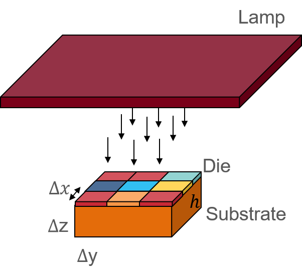
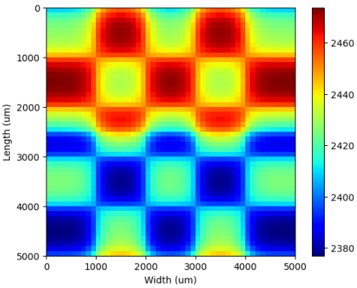

# RTA-simulator
Thermal analysis to measure on-die temperature during rapid thermal annealing (RTA).

[](https://commons.wikimedia.org/wiki/File:Blue_Python_3.6_Shield_Badge.svg)
[](https://github.com/UMN-EDA/RTA-simulator/archive/refs/heads/main.zip)
[](https://github.com/UMN-EDA/RTA-simulator)
[](https://github.com/UMN-EDA/RTA-simulator/issues)
[](https://opensource.org/licenses/BSD-3-Clause)

Rapid thermal annealing (RTA) involves the application of high temperature
for a short period to perform dopant activation, and is an important process
step. It is critically important to ensure that annealing occurs uniformly across
the entire die. This repository contains software to perform thermal analysis to determine the temperature profile of a die under RTA, considering radiation and conduction effects. The software builds and solves a second-order partial differential equation to generate the on-die temperature profile.




## Tutorial

### Prerequisites
+ python 3.6.3
+ pip 21.2.3

### Download and install on a machine
Clone the repository using the following commands and change the directory to RTA-simulator home directory:

```
git clone https://github.com/UMN-EDA/RTA-simulator.git
cd RTA-simulator
```

To install RTA-simulator, create and activate a virtual environment, and install the python packages needed using the following commands:
Note that a working internet connection is needed to download and install the python packages listed in the requirements.txt file:

```
python3 -m venv UMN-RTA
source UMN-RTA/bin/activate.csh # if bash ./UMN-RTA/bin/activate
pip3 install -r requirements.txt
```

Check if installation is successful with the following command:
```
python3 src/ThermalAnalyzer.py --help
```

### TL;DR. Quick example run commands
The software is made available with three inbuilt emmisivity pattern generators that reperesent three testcases from Fig. 10 [this][1] research article. 

The following sequence of commands runs the thermal analysis software on the superposition test pattern from Fig. 10 of this work as an example. 

```
python3 src/ThermalAnalyzer.py -v simulate -t 3 -r 500 -tm 2e-3 -ts 1e-4 -tp 1e-3 -o results/test
python3 src/ThermalAnalyzer.py visualize -t 1e-3 -lvw -s results/test/temperature_solution.npz
```

Command description:
1. The first command simulates RTA process on testcase 3 (superposition) with a region size of 500um, for a maximum time duration of 2ms, with step size 0.1ms, a pulse width of 1ms, and stores the generated output in results/test in the form of a .NPZ file. 
2. The second command visualizes the thermal profiles across the length and width of the die at the 1ms point of time.

The following sequence of commands runs the thermal analysis software on testcases specified as GDS. 

```
python3 src/ThermalAnalyzer.py preprocessGDS -g input_data/TCAD_RTP_A.gds -o results/test/
python3 src/ThermalAnalyzer.py visualize -e results/test/TCAD_RTP_A.npz  -r 1
python3 src/ThermalAnalyzer.py simulate -g results/test/TCAD_RTP_A.npz -r 500 -tm 2e-3 -ts 1e-4 -tp 1e-3 -o results/test/
python3 src/ThermalAnalyzer.py visualize -t 1e-3 -lvw -s results/test/temperature_solution.npz
```

1. The first command process the GDS to generate a .NPZ file. 
2. The second command reads the .NPZ file and plots it for visualization purposes at a 1um resolution. 
3. The third command simulates the RTA process to using the generated emissivity pattern from the GDS, at a region size of 500um, for a duration of 2ms in step size of 0.1ms, annealing time of 1ms, and stores the generated results in the form of images in the output results/test directory.
4. The second command visualizes the thermal profiles across the length and width of the die at the 1ms point of time.

For details on information on the arguments refer the next section. 

### Detailed information on arguments and usage
Details on the argument this tool supports:
```
python3 src/ThermalAnalyzer.py --help
```
```
usage: ThermalAnalyzer [-h] [-v | -q | -d] [-l LOG] [-p SOLVERPARAMS]
                       {simulate,visualize,preprocessGDS} ...
```
| Argument              	| Comments                                              |
|-----------------------	|-------------------------------------------------------|
| -h, --help            	| Show this help message and exit.                      |
| -v, --verbose         	| Enables verbose mode with detailed information.       |
|  -q, --quiet            | No information, warning messages displayed.          |
| -d, --debug             | Displays additional debug messages for software debug.|
| -l LOG, --log_file LOG  | Log file for run.                   	                  |
| -p SOLVERPARAMS,        | JSON file containing necessary definition to run the tool. By default loads RTA-simulator/config/SolverParams.json |

This software runs in three different modes of operation as summarized below:

1. preprocessGDS:  Preprocess the GDSII/JSON file to a preprocessed NPZ  file that the other subcommands can use
2. simulate:    Setup the tool in thermal simulation mode to run analysis on the provided GDS.
3. visualize:  Set of suboptions available for visualizing the inputs/outputs

For additional information of each mode run `python3 src/ThermalAnalyzer.py <mode> --help`

#### PreprocessGDS mode
The preprocessGDS mode is to read a GDS file and generate a parsed emissivity matrix that is stored in the .npz file.

```
Usage: ThermalAnalyzer preprocessGDS [-h] (-j JSONFILE | -g GDSFILE) -o OUTDIR
```

| Argument              	| Comments                                              |
|-----------------------	|-------------------------------------------------------|
| -h, --help            	| Show this help message and exit.                      |
| -g, GDSFILE (required)	| Load GDS information from a GDSII file.               |
| -o OUTDIR (required)    | Destination directory for output NPZ files.           |


#### Simulate mode
Thermal simulation mode builds and solves the partial differential equation to
solve for the thermal profile. 

```
usage: ThermalAnalyzer simulate [-h] (-g NPZFILE | -t {1,2,3}) -r R -tm T_MAX
                                -ts T_STEP -tp PW_LAMP [-o OUTDIR] [-k]
```

| Argument              	              | Comments                                         |
|---------------------------------------|--------------------------------------------------|
| -h, --help            	              | Show this help message and exit.                 |
| -g NPZFILE, --preprocessedGDS NPZFILE | Path to the preprocessed NPZ file for simulation |
| -t {1,2,3}, --testcase {1,2,3}        | Run predefined testcases                         |
| -r R, --resolution R                  | FEM element regions size on the surface plot     |
| -tm T_MAX, --time_max T_MAX           | Maximum time for the simulation                  |
| -ts T_STEP, --time_step T_STEP        | Time step resolution for the simulation          |
| -tp PW_LAMP, --time_pulse PW_LAMP     | Time duration of the lamp pulse for the simulation| 
| -o OUTDIR, --outDir OUTDIR            | Destination directory for output solution files. |
| -k, --enable_t_k_scaling              | Enable temperature based conductivity scaling. |


#### Visualize mode
This mode is to plot and visualize the emissivity profile and output temperature
profiles

```
usage: ThermalAnalyzer visualize [-h] [-e NPZFILE] [-r R] [-o OUTDIR]
                                 [-t T_POINT] [-lvw] [-lvt] [-lvh]
                                 [-s SOLFILE]
```
| Argument              	              | Comments                                         |
|---------------------------------------|--------------------------------------------------|
| -h, --help            	              | Show this help message and exit.                 |
| -o OUTDIR, --outDir OUTDIR            | Destination directory for output solution files. |
| -e NPZFILE, --emissivity NPZFILE      | Path to the preprocessed NPZ file for emissivity plot |
| -r R, --resolution R                  | Resolution in um (int) for emissivity plot       |
| -t T_POINT, --time_point T_POINT      | Time point at which to plot the result           |
| -lvw, --lenVwidth                     | Plot length vs. width for the provided time point|
| -lvt, --lenVtime                      | Plot length vs. time along the center of the die |
| -lvh, --lenVheight                    | Plot length vs. height for the provided time point along the center of the die |
| -s SOLFILE, --solution SOLFILE        | Path to the generated solution file from simulation |
|-k, --enable_t_k_scaling               | Enable temperature based scaling of thermal conductivity of silicon. By default is disabled |


[1]: https://iopscience.iop.org/article/10.1149/1.2911486/meta?casa_token=dj3PKG6YzRcAAAAA:CPAa45eOZ4541aEvu9fS7YeMuHEDhU8Fu8qyedCaq0lutUXtlN12K8qmC_GnxTZ2S2trhaYx
